# Project-Cafe-Sales
 The main purpose of this project is to demonstrate my Data-Cleaning capabilities using SQL and how well it translates into the Data Exploration Analysis process. The Data-Cleaning process is the most important step in Data Analysis. The cleaner the data the better and more accurate reports will be produced which positively impacts a business in the real-world, especially in regards to their achieving objectives.

 NOTE: There will be some descriptive elements in this project detailing my thought processes in order to convey soft-skills such as writing & communication, storytelling, critical-thinking, adaptability, etc.

Check out Excel Dashboard: [Cafe Sale Dashboard](cafe_dashboard)

Check out SQL Queries: [SQL Queries](SQL_Queries)

## Table of Contents
- [Project-Cafe-Sales](#project-cafe-sales)
  - [Table of Contents](#table-of-contents)
  - [1. Introduction:](#1-introduction)
    - [1.1 Company Background](#11-company-background)
  - [2. Prepare Phase](#2-prepare-phase)
    - [2.1 Data Used](#21-data-used)
    - [2.2 Accessibility \& Usage of Data](#22-accessibility--usage-of-data)
    - [2.3 Data Limitations \& Integrity](#23-data-limitations--integrity)
    - [2.4 Tools and Methodologies](#24-tools-and-methodologies)
  - [3. Process Phase](#3-process-phase)
    - [3.1 Data Preparation](#31-data-preparation)
    - [3.2 Data Cleaning](#32-data-cleaning)
      - [1. Data Standardization](#1-data-standardization)
      - [2. Handle Missing Data](#2-handle-missing-data)
  - [4. Exploratory Data Analysis (EDA)](#4-exploratory-data-analysis-eda)
      - [1. What are the Best-Selling and Worst-selling Items?](#1-what-are-the-best-selling-and-worst-selling-items)
      - [2. What the most popular Category?](#2-what-the-most-popular-category)
      - [3. What is the average transaction value?](#3-what-is-the-average-transaction-value)
      - [4. What are customers' spending habits?](#4-what-are-customers-spending-habits)
      - [5. What Item generates the most Revenue?](#5-what-item-generates-the-most-revenue)
      - [6. Revenue By Payment Method?](#6-revenue-by-payment-method)
      - [7. Revenue By Location?](#7-revenue-by-location)
      - [8. Sales Revenue Performance By Month?](#8-sales-revenue-performance-by-month)
      - [9. Seasonal Trend?](#9-seasonal-trend)
      - [10. Sales Revenue Performance By Day?](#10-sales-revenue-performance-by-day)
  - [5. Cafe Sales Dashboard](#5-cafe-sales-dashboard)
  - [6. Conclusion \& Recommendations](#6-conclusion--recommendations)

## 1. Introduction: 
### 1.1 Company Background
There is no information available nor provided about the the company behind the dataset. From the dataset one can infer that the company has established a typical cafe that serves coffee, tea, pastries, and light meals such as a sandwich.

## 2. Prepare Phase
### 2.1 Data Used 
The data source used for this Project is https://www.kaggle.com/datasets/ahmedmohamed2003/cafe-sales-dirty-data-for-cleaning-training/data.
This dataset was downloaded from Kaggle where it was uploaded by Ahmed Mohamed.

### 2.2 Accessibility & Usage of Data 
The dataset was published by Ahmed Mohamed to kaggle.com under the License CC BY-SA 4.0 allowing others to distribute, remix, tweak, and build upon the work, even commercially, as long as credit is given for the original creation.

### 2.3 Data Limitations & Integrity
This Cafe Sales dataset contains 10 columns and a total of 10,000 records:
- **Transaction ID**: A unique identifier for each transaction.
- **Item**: The name of the product being purchased.
- **Quantity**: The number of units purchased.
- **Price Per Unit**: The cost of a single unit of the item.
- **Total Spent**: The total amount paid for the transaction (Quantity * Price Per Unit).
- **Payment Method**: The method of payment used (e.g. Cash, Credit Card).
- **Location**: LocatTion where the transaction occurred (e.g. In-store, Take-away).
- **Transaction Date**: The date when the transaction was made.

The dataset is useful for Analyzing sales and customer purchasing behavior. However, the lack of Customer information unables us to group customers based on shared characteristics, behaviors, or preferences, with the aim of assisting marketing teams or sales teams to reach out to those customers more effectively and deliver more relevant experiences.

The dataset also appears to be inconsistent, containing many missing and invalid values such as, NULLs, ERRORs, and Blank-spaces.

### 2.4 Tools and Methodologies
**Tools:**

- **MYSQL:** Our Database Management System used for preparing and querying the data for Exploratory Date Analysis.

- **Excel:** Our main tool used to visualize data.

- **Git & GitHub:** Crucial for version control and sharing SQL scripts and analysis, ensuring project tracking and potential collaboration.

- **Visual Studio Code:** For managing Git repositories committing changes, and handling branches.

**Methodolgies:**

- **Descriptive analysis:** Our main focus here is to describe, summarize, interpret, and present the main features (characteristics, patterns, and trends) of the dataset in a meaningful way without drawing conclusions beyond the data itself.

- **Time-series analysis:** Here we will identify trends over time and seasonal patterns, to draw insights.

## 3. Process Phase
### 3.1 Data Preparation
Ideally the data would be prepared in Excel and imported into MYSQL for analysis. However, because CSV files only store plain text and delimiter characters, all formatting is lost.

Instead we create a new database **'cafe_db'** and import all the data as a text datatype. We do this because MYSQL truncates records when it detects any imported value that does not match the data type of the column they are being imported into. In our case, invalid values such as 'ERROR' and 'UNKNOWN' are text data types which can be found in numeric and date columns.

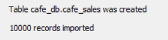

<details>
<summary> How would I have prepared the data in Excel?
</summary>

We explore the dataset by filtering the column headers to narrow down the data. In our findings we discover that every column aside for the **Transactions ID** have either missing values (e.g. blank or empty spaces) or invalid values (e.g. 'ERROR', 'UNKNOWN'). This inconsistency further hinders the integrity of the data as there are text values (e.g. ERROR', 'UNKNOWN') in the date column **Transactions ID**, and in the numeric columns **Quantity**, **Price Per Unit**, and **Total Spent**.

Data Cleaning steps using Excel to Standardize the data:

1. We use the 'duplicate data' tool to check for any duplicates in our dataset.
   - **No duplicates were found.**

2. We use the 'LEN' function to return the length of every Transaction ID to verify the validity of each unique ID.
   - **Every Unique ID returned the length of 11.** 

3. We sort the data by Transaction ID (lowest to highest) to maintain an organized structure.
  
4. We use the 'Find & Replace' tool to convert all the invalid values ('ERROR' and 'UNKNOWN') into blanks.
   - **A total of 3,283 invalid values were replaced.**

5. We format all numerical data into Number or decimal datatypes for consistency. 

6. We transform the **Transaction Date** column into YYYY-MM-DD date format which MYSQL uses.
</details>

### 3.2 Data Cleaning
#### 1. Data Standardization

Since there are no duplicates to handle, we begin with Data Standardization, the process of converting raw data into a common format to enable us to process and analyze it. This is a significant step as it ensures consistency in our data.

We verify if all 10,000 unique Transaction IDs follow the same correct format. In this instance, we check if all Unique IDs match the correct length.

```sql
-- CHECK IF ALL UNIQUE IDs MATCH IN LENGTH
SELECT DISTINCT LENGTH(`Transaction ID`) AS ID_length
FROM cafe_sales; -- all match length: 11
```
In order to correct the numeric and date columns with the appropriate datatypes, we must ensure that the values are all in the same format:

```SQL
-- REMOVE TEXT VALUES FROM NUMERIC COLUMN
UPDATE cafe_sales SET Quantity = NULL
WHERE Quantity IN ('ERROR', 'UNKNOWN', '');
-- CORRECT DATATYPE
ALTER TABLE cafe_sales MODIFY Quantity INT;
```

```SQL
-- CORRECT FORMAT
UPDATE cafe_sales 
SET `Price Per Unit` =
	    CASE
			WHEN `Price Per Unit` = '1' THEN '1.00'
			WHEN `Price Per Unit` = '1.5' THEN '1.50'
			WHEN `Price Per Unit` = '2' THEN '2.00'
			WHEN `Price Per Unit` = '3' THEN '3.00'
			WHEN `Price Per Unit` = '4' THEN '4.00'
			WHEN `Price Per Unit` = '5' THEN '5.00'
			ELSE NULL
		END;
-- CORRECT DATATYPE
ALTER TABLE cafe_sales MODIFY `Price Per Unit` DECIMAL(10, 2);
```

```sql
-- CORRECT FORMAT
UPDATE cafe_sales 
SET `Total Spent` =
	    CASE
			WHEN `Total Spent` = '1' THEN '1.00'
			WHEN `Total Spent` = '1.5' THEN '1.50'
			WHEN `Total Spent` = '2' THEN '2.00'
			WHEN `Total Spent` = '3' THEN '3.00'
			WHEN `Total Spent` = '4' THEN '4.00'
            WHEN `Total Spent` = '4.5' THEN '4.50'
			WHEN `Total Spent` = '5' THEN '5.00'
            WHEN `Total Spent` = '6' THEN '6.00'
            WHEN `Total Spent` = '7.5' THEN '7.50'
            WHEN `Total Spent` = '8' THEN '8.00'
            WHEN `Total Spent` = '9' THEN '9.00'
            WHEN `Total Spent` = '10' THEN '10.00'
            WHEN `Total Spent` = '12' THEN '12.00'
            WHEN `Total Spent` = '15' THEN '15.00'
            WHEN `Total Spent` = '16' THEN '16.00'
            WHEN `Total Spent` = '20' THEN '20.00'
            WHEN `Total Spent` = '25' THEN '25.00'
			ELSE NULL
		END;
-- CORRECT DATATYPE
ALTER TABLE cafe_sales MODIFY `Total Spent` DECIMAL(10, 2);
```
```sql
-- REMOVE TEXT VALUES FROM DATE
UPDATE cafe_sales SET `Transaction Date` = NULL
WHERE `Transaction Date` IN ('ERROR', 'UNKNOWN', '');
-- CORRECT FORMAT
UPDATE cafe_sales SET `Transaction Date` = STR_TO_DATE(`Transaction Date`, '%d/%m/%Y');
-- CORRECT DATATYPE
ALTER TABLE cafe_sales MODIFY `Transaction Date` DATE;
```
The rest of the columns are in the correct Text datatype and format, thefore we simply convert all invalid and missing values into NULL values to facilitate the cleaning process.

#### 2. Handle Missing Data
Previously, we generalized all missing and invalid data by converting them into NULL values. By doing so, we can easily monitor and handle all the NULLs within any query.

The following displays how many missing values there are out of the 10,000 records:
```sql
-- NULL VALUE OVERVIEW
SELECT 
    SUM(Item IS NULL) AS item,
    SUM(Quantity IS NULL) AS quantity,
    SUM(`Price Per Unit` IS NULL) AS price_per_unit,
    SUM(`Total Spent` IS NULL) AS total,
    SUM(`Payment Method` IS NULL) AS pay_method,
    SUM(Location IS NULL) AS location,
    SUM(`Transaction Date` IS NULL) AS `date`
FROM cafe_sales;
```
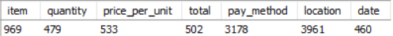

We first focus on filling the missing data with the data already available to us. For example, with a simple 'SELECT DISTINCT' statement, we can identify the **'price per unit'** for each unique **'item'** and then replace the null values with the correct price:

 ```sql
-- FILL IN MISSING VALUES FOR PRICE PER UNIT
UPDATE cafe_sales SET `Price Per Unit` = 3.00
WHERE `Price Per Unit` IS NULL AND Item = 'Cake';

UPDATE cafe_sales SET `Price Per Unit` = 2.00
WHERE `Price Per Unit` IS NULL AND Item = 'Coffee';

UPDATE cafe_sales SET `Price Per Unit` = 1.00
WHERE `Price Per Unit` IS NULL AND Item = 'Cookie';

UPDATE cafe_sales SET `Price Per Unit` = 3.00
WHERE `Price Per Unit` IS NULL AND Item = 'Juice';

UPDATE cafe_sales SET `Price Per Unit` = 5.00
WHERE `Price Per Unit` IS NULL AND Item = 'Salad';

UPDATE cafe_sales SET `Price Per Unit` = 4.00
WHERE `Price Per Unit` IS NULL AND Item = 'Sandwich';

UPDATE cafe_sales SET `Price Per Unit` = 4.00
WHERE `Price Per Unit` IS NULL AND Item = 'Smoothie';

UPDATE cafe_sales SET `Price Per Unit` = 1.50
WHERE `Price Per Unit` IS NULL AND Item = 'Tea';

UPDATE cafe_sales SET `Price Per Unit` = ROUND(`Total Spent` / Quantity, 2)
WHERE `Price Per Unit` IS NULL AND (Quantity IS NOT NULL AND `Total Spent` IS NOT NULL);
```
By using the data available and applying simple arithmetic calculations such as multiplying the **'price per unit'** and **'quantity'**, we can work out the missing **'Total Spent'** values:

```sql
--  FILL IN MISSING VALUES FOR  TOTAL SPENT
UPDATE cafe_sales SET `Total Spent` = Quantity * `Price Per Unit`
WHERE `Total Spent` IS NULL AND Quantity IS NOT NULL;

--  FILL IN MISSING VALUES FOR QUANTITY
UPDATE cafe_sales SET Quantity = ROUND(`Total Spent` / `Price Per Unit`)
WHERE Quantity IS NULL AND `Total Spent` IS NOT NULL;
```
A small complication arises when filling out the name of the items using their fixed price. Items such as 'Cake' and 'Juice' have the same price assigned to it meaning there is no definite way of knowing which of the two is being purchased in that transaction. Instead of making an assumption based on no factual information, we assign a new name combining both the items into one name like 'Cake/Juice':
```sql
-- FILL IN MISSING VALUES FOR ITEMS
UPDATE cafe_sales SET Item = 'Cake/Juice'
WHERE Item IS NULL AND `Price Per Unit` = 3.00;

UPDATE cafe_sales SET Item = 'Coffee'
WHERE Item IS NULL AND `Price Per Unit` = 2.00;

UPDATE cafe_sales SET Item = 'Cookie'
WHERE Item IS NULL AND `Price Per Unit` = 1.00;

UPDATE cafe_sales SET Item = 'Salad'
WHERE Item IS NULL AND `Price Per Unit` = 5.00;

UPDATE cafe_sales SET Item = 'Sandwich/Smoothie'
WHERE Item IS NULL AND `Price Per Unit` = 4.00;

UPDATE cafe_sales SET Item = 'Tea'
WHERE Item IS NULL AND `Price Per Unit` = 1.50;
```
Similarly, there is no additional information to assist us in filling the missing values for **'Payment Method'** and **'Location'**, therefore we assign those values as 'Unknown':
```sql
-- FILL IN MISSING VALUES FOR PAYMENT METHOD

UPDATE cafe_sales SET `Payment Method` = 'Unknown'
WHERE `Payment Method` IS NULL;

-- FILL IN MISSING VALUES FOR LOCATION
UPDATE cafe_sales SET Location = 'Unknown'
WHERE Location IS NULL;
```
For the **'Transaction Date'**, we use a fill-down approach to replace the null values with the next known date. While this might slightly affect the dataset's integrity, it is a much better choice than removing the entire row when there is still valuable data for analysis.
```sql
-- FILL IN MISSING VALUES FOR TRANSACTION DATE
WITH date_fix AS (
SELECT 
	`Transaction ID`,
	COALESCE(`Transaction Date`, LAG(`Transaction Date`) OVER (ORDER BY `Transaction ID`)) AS filled_date
FROM cafe_sales
)
UPDATE cafe_sales t1
JOIN date_fix t2
	ON t1.`Transaction ID` = t2.`Transaction ID`
SET t1.`Transaction Date` = t2.filled_date;
```
At this check-point, we find ourselves with 26 rows that contain a total of 52 NULL values across four columns.
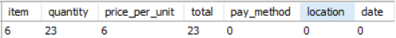

```sql
-- Returns 26 rows containing the 52 NULL values
SELECT * FROM cafe_sales
WHERE Item IS NULL OR
Quantity IS NULL OR
`Price Per Unit` IS NULL OR
`Total Spent` IS NULL;
```
We will utilize the mode to address the remaining null values because, in statistics, the mode represents the value that appears most frequently in a data set, indicating it's the most probable outcome. 

In the 20 rows with missing values, **'Price Per Unit'** is known. To complete the records, we will utilize the most frequently occurring **'Total Price'** corresponding to each unique **'Price Per Unit'**.


```sql
-- FIND THE MOST 'TOTAL SPENT' VALUE WHEN PRICE PER UNIT IS 5.00
SELECT DISTINCT `Total Spent`, COUNT(`Total Spent`) AS frequency FROM cafe_sales
WHERE `Price Per Unit` = 5.00
GROUP BY `Total Spent`
ORDER BY 1 DESC
lIMIT 1; -- 25.00 is the most frequency total when unit price is 5.00

-- FIND THE MOST TOTAL SPENT VALUE WHEN PRICE PER UNIT IS 4.00
SELECT DISTINCT `Total Spent`, COUNT(`Total Spent`) AS frequency FROM cafe_sales
WHERE `Price Per Unit` = 4.00
GROUP BY `Total Spent`
ORDER BY 1 DESC
LIMIT 1; -- 20.00 is the most frequency total when unit price is 4.00

-- FIND THE MOST TOTAL SPENT VALUE WHEN PRICE PER UNIT IS 3.00
SELECT DISTINCT `Total Spent`, COUNT(`Total Spent`) AS frequency FROM cafe_sales
WHERE `Price Per Unit` = 3.00
GROUP BY `Total Spent`
ORDER BY 1 DESC
LIMIT 1; -- 15.00 is the most frequency total when unit price is 3.00

-- FIND THE MOST TOTAL SPENT VALUE WHEN PRICE PER UNIT IS 2.00
SELECT DISTINCT `Total Spent`, COUNT(`Total Spent`) AS frequency FROM cafe_sales
WHERE `Price Per Unit` = 2.00
GROUP BY `Total Spent`
ORDER BY 1 DESC
LIMIT 1; -- 10.00 is the most frequency total when unit price is 2.00

-- FIND THE MOST TOTAL SPENT VALUE WHEN PRICE PER UNIT IS 1.50
SELECT DISTINCT `Total Spent`, COUNT(`Total Spent`) AS frequency FROM cafe_sales
WHERE `Price Per Unit` = 1.50
GROUP BY `Total Spent`
ORDER BY 1 DESC
LIMIT 1; -- 7.50 is the most frequency total when unit price is 1.50

-- FIND THE MOST TOTAL SPENT VALUE WHEN PRICE PER UNIT IS 1.00
SELECT DISTINCT `Total Spent`, COUNT(`Total Spent`) AS frequency FROM cafe_sales
WHERE `Price Per Unit` = 1.00
GROUP BY `Total Spent`
ORDER BY 1 DESC
LIMIT 1; -- 5.00 is the most frequency total when unit price is 1.00
```

*Table summary for our findings:*

| Price Per Unit | Total Spent | Quantity
|----------|----------|----------|
|   5.00   |   25.00  |    5     |
|   4.00   |   20.00  |    5     |
|   3.00   |   15.00  |    5     |
|   2.00   |   10.00  |    5     |
|   1.50   |   7.50   |    5     |
|   1.00   |   5.00   |    5     |

```sql
-- FILL IN WHERE PRICE PER UNIT IS 5.00 AND OTHER COLUMNS ARE NULL
UPDATE cafe_sales
SET `Total Spent` = 25.00,
    Quantity = 5
WHERE `Price Per Unit` = 5.00 
AND (Quantity IS NULL AND `Total Spent` IS NULL);

-- FILL IN WHERE PRICE PER UNIT IS 4.00 AND OTHER COLUMNS ARE NULL
UPDATE cafe_sales
SET `Total Spent` = 20.00,
    Quantity = 5
WHERE `Price Per Unit` = 4.00 
AND (Quantity IS NULL AND `Total Spent` IS NULL);

-- FILL IN WHERE PRICE PER UNIT IS 3.00 AND OTHER COLUMNS ARE NULL
UPDATE cafe_sales
SET `Total Spent` = 15.00,
    Quantity = 5
WHERE `Price Per Unit` = 3.00 
AND (Quantity IS NULL AND `Total Spent` IS NULL);

-- FILL IN WHERE PRICE PER UNIT IS 2.00 AND OTHER COLUMNS ARE NULL
UPDATE cafe_sales
SET `Total Spent` = 10.00,
    Quantity = 5
WHERE `Price Per Unit` = 2.00 
AND (Quantity IS NULL AND `Total Spent` IS NULL);

-- FILL IN WHERE PRICE PER UNIT IS 1.50 AND OTHER COLUMNS ARE NULL
UPDATE cafe_sales
SET `Total Spent` = 7.50,
    Quantity = 5
WHERE `Price Per Unit` = 1.50 
AND (Quantity IS NULL AND `Total Spent` IS NULL);

-- FILL IN WHERE PRICE PER UNIT IS 1.00 AND OTHER COLUMNS ARE NULL
UPDATE cafe_sales
SET `Total Spent` = 5.00,
    Quantity = 5
WHERE `Price Per Unit` = 1.00 
AND (Quantity IS NULL AND `Total Spent` IS NULL);
```
</details>

We proceed with the same workflow as above to fill in the rest of the columns **'Quantity'** & **'Total Spent'**

<details>
<summary> SQL Code for 'Quantity'
</summary>

```sql
-- FIND THE MODE VALUES TO FILL THE NULLS WHERE 'TOTAL SPENT' IS KNOWN
-- FIND THE MOST 'Price Per Unit' VALUE WHEN TOTAL SPENT IS 25.00
SELECT DISTINCT `Price Per Unit`, COUNT(`Price Per Unit`)
FROM cafe_sales
WHERE `Total Spent` = 25.00
GROUP BY `Price Per Unit`
ORDER BY 1 DESC
LIMIT 1; -- 5.00 is the most frequent 'Price Per Unit' when 'Total Spent' is 25.00

-- FIND THE MOST 'Price Per Unit' VALUE WHEN TOTAL SPENT IS 20.00
SELECT DISTINCT `Price Per Unit`, COUNT(`Price Per Unit`)
FROM cafe_sales
WHERE `Total Spent` = 20.00
GROUP BY `Price Per Unit`
ORDER BY 1 DESC
LIMIT 1; -- 5.00 is the most frequent 'Price Per Unit' when 'Total Spent' is 20.00

-- FIND THE MOST 'Price Per Unit' VALUE WHEN TOTAL SPENT IS 9.00
SELECT DISTINCT `Price Per Unit`, COUNT(`Price Per Unit`)
FROM cafe_sales
WHERE `Total Spent` = 9.00
GROUP BY `Price Per Unit`
ORDER BY 1 DESC
LIMIT 1; -- 3.00 is the most frequent 'Price Per Unit' when 'Total Spent' is 9.00

-- FILL IN THE NULL VALUES USING THE MODE
-- FILL IN WHERE TOTAL SPENT IS 25.00 AND OTHER COLUMNS ARE NULL
UPDATE cafe_sales
SET Item = 'Salad',
	Quantity = 5,
    `Price Per Unit` = 5.00
WHERE `Total Spent` = 25.00
AND (Item IS NULL AND Quantity IS NULL AND `Price Per Unit` IS NULL);

-- FILL IN WHERE TOTAL SPENT IS 20.00 AND OTHER COLUMNS ARE NULL
UPDATE cafe_sales
SET Item = 'Salad',
	Quantity = 4,
    `Price Per Unit` = 5.00
WHERE `Total Spent` = 20.00
AND (Item IS NULL AND Quantity IS NULL AND `Price Per Unit` IS NULL);

-- FILL IN WHERE TOTAL SPENT IS 9.00 AND OTHER COLUMNS ARE NULL
UPDATE cafe_sales
SET Item = 'Cake/Juice',
	Quantity = 2,
    `Price Per Unit` = 3.00
WHERE `Total Spent` = 9.00
AND (Item IS NULL AND Quantity IS NULL AND `Price Per Unit` IS NULL);
```
</details>

<details>
<summary> SQL Code for 'Total Spent'
</summary>

```sql
-- FIND THE MODE VALUES TO FILL THE NULLS WHERE QUANTITY IS KNOWN
-- FIND THE MOST 'TOTAL SPENT' VALUE WHEN QUANTITY IS 4
SELECT DISTINCT `Total Spent`, COUNT(`Total Spent`)
FROM cafe_sales
WHERE Quantity = 4
GROUP BY `Total Spent`
ORDER BY 1 DESC LIMIT 1; -- 20.00 is the most frequency Total Spent When quantity is 4

-- FIND THE MOST 'TOTAL SPENT' VALUE WHEN QUANTITY IS 2
SELECT DISTINCT `Total Spent`, COUNT(`Total Spent`)
FROM cafe_sales
WHERE Quantity = 2
GROUP BY `Total Spent`
ORDER BY 1 DESC LIMIT 1; -- 10.00 is the most frequency Total Spent When quantity is 2
-- FILL IN THE NULL VALUES USING THE MODE
-- FILL IN WHERE QUANTITY IS 4 AND OTHER COLUMNS ARE NULL
UPDATE cafe_sales
SET Item = 'Salad',
    `Price Per Unit` = 5.00,
	`Total Spent` = 20.00
WHERE Quantity = 4
AND (Item IS NULL AND `Price Per Unit` IS NULL AND `Total Spent` IS NULL);

-- FILL IN WHERE QUANTITY IS 2 AND OTHER COLUMNS ARE NULL
UPDATE cafe_sales
SET Item = 'Salad',
    `Price Per Unit` = 5.00,
	`Total Spent` = 10.00
WHERE Quantity = 2
AND (Item IS NULL AND `Price Per Unit` IS NULL AND `Total Spent` IS NULL);
```

</details>

To finalize our Data Cleaning process, we ensure that all 10,000 entries have no missing values:

```sql
-- FINAL SUMMARY
SELECT 
    SUM(Item IS NOT NULL) AS item,
    SUM(Quantity IS NOT NULL) AS quantity,
    SUM(`Price Per Unit` IS NOT NULL) AS price_per_unit,
    SUM(`Total Spent` IS NOT NULL) AS total,
    SUM(`Payment Method` IS NOT NULL) AS pay_method,
    SUM(Location IS NOT NULL) AS location,
    SUM(`Transaction Date` IS NOT NULL) AS `date`
FROM cafe_sales; -- all columns have no nulls
```
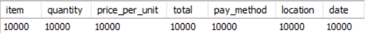

## 4. Exploratory Data Analysis (EDA)
#### 1. What are the Best-Selling and Worst-selling Items?

```sql
SELECT 
	DISTINCT Item,
    `Price Per Unit`,
    SUM(Quantity) AS Total_Quantity
FROM cafe_sales
GROUP BY 1, 2
ORDER BY 3 DESC; -- Coffee is the most sold item with 3,929
```
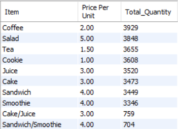

**Best-Selling Items:**
- Coffee (3,929 units) is the most popular item, likely due to its broad appeal and habitual consumption.

- Salad (3,848 units) is the second most popular item despite being the most expensive on the menu, which indicates a strong demand for healthy options.

- Tea (3,655 units) is the third most popular item, suggesting a preference for warm beverages.

**Worst-Selling Items:**
- Smoothie (3,346 units) is the least popular item, which further suggests a preference for warm beverages.

**Well-Balanced Menu:**
- There is a small difference in the quantity sold between items. Even distribution of sales indicates a well-rounded menu appeal that satisfies diverse customer preferences. This leads to stable revenue streams, reducing business risk as there is no dependence on any single item to perform.

#### 2. What the most popular Category?

```sql
SELECT 
	CASE
		WHEN Item = 'Coffee' THEN 'Warm Beverages'
        WHEN Item = 'Salad' THEN 'Healthy Snacks'
        WHEN Item = 'Tea' THEN 'Warm Beverages'
        WHEN Item = 'Cookie' THEN 'Snacks'
        WHEN Item = 'Juice' THEN 'Cold Beverages'
        WHEN Item = 'Cake' THEN 'Snacks'
        WHEN Item = 'Sandwich' THEN 'Healthy Snacks'
        WHEN Item = 'Smoothie' THEN 'Cold Beverages'
		ELSE 'Unknown'
    END AS Category,
    SUM(Quantity) AS Total_Quantity
FROM cafe_sales
GROUP BY category
ORDER BY 2 DESC; -- Warm Beverages is the most sold category with 7,584
```
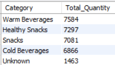

**Customer Preferences:**
- Warm Beverages such as 'Coffee' and 'Tea' have a higher demand than Cold Beverages like 'Juice' and 'Smoothies'.

- Healthy Snacks such as 'Salad' and 'Sandwich' have higher demand than regular indulgent Snacks like 'Cookie' and 'Cake'.

**Bundling & Promotions:**
- **Cross-selling:** 
  - Warm Beverages ('Coffee' or 'Tea') + Snacks ('Cookie' or 'Cake') as a classic combo.
  - Cold Beverages ('Juice' or 'Smoothie') + Healthy Snacks ('Salad' or 'Sandwich') as a healthy combo.

#### 3. What is the average transaction value?

```sql
-- 3. AVERAGE TRANSACTION VALUE?
SELECT 
    ROUND(SUM(Quantity * `Price Per Unit`) / COUNT(DISTINCT `Transaction ID`), 2) AS average_transaction_value,
    MIN(`Total Spent`) AS least_spent, 
    MAX(`Total Spent`) AS most_spent
FROM cafe_sales; -- average value per transaction is 8.94
```
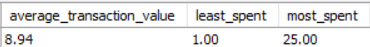

**Average Transaction Value:** 
- The average amount spent on a single transaction ($8.94) is closer to the lowest ($1.00) than the highest ($25.00). However, it is also worth mentioning that the average is still higher than the most expensive item ($5.00). This implies that people are more likely to purchase multiple items, which may be influenced by the low prices.
- **Recommendations:** Offering bundled items or increasing prices could help boost the average transaction value.

**Price Range:**
- The difference between the lowest ($1.00) and highest ($25.00) transaction is $24.00, which suggests diverse customer spending habits. 

**Customer Segmentation:** 
- There might be distinct customer groups who are making larger purchases. Perhaps these transactions are being made by large groups such as families, a group of friends, or co-workers. Knowing who is making these types of transactions may help in understanding their behaviors to tailor marketing efforts.

#### 4. What are customers' spending habits? 

```sql
WITH frequency_table AS (
SELECT 
    CASE 
        WHEN `Total Spent` BETWEEN 1.00 AND 5.00 THEN '1.00 - 5.00'
        WHEN `Total Spent` BETWEEN 5.00 AND 10.00 THEN '5.00 - 10.00'
        WHEN `Total Spent` BETWEEN 10.00 AND 15.00 THEN '10.00 - 15.00'
        WHEN `Total Spent` BETWEEN 15.00 AND 20.00 THEN '15.00 - 20.00'
        ELSE '20+' 
    END AS total_spent_range,
    COUNT(*) AS Frequency
FROM cafe_sales
GROUP BY total_spent_range
ORDER BY Frequency DESC
)
SELECT
	total_spent_range,
    Frequency,
	ROUND((SUM(Frequency) * 100.0 / (SELECT SUM(Frequency) FROM frequency_table)), 2) AS Relative_Frequency
FROM frequency_table
GROUP BY total_spent_range
ORDER BY Frequency DESC; -- frequency table for histogram
```
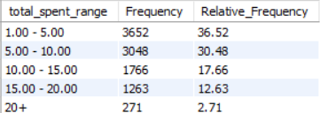

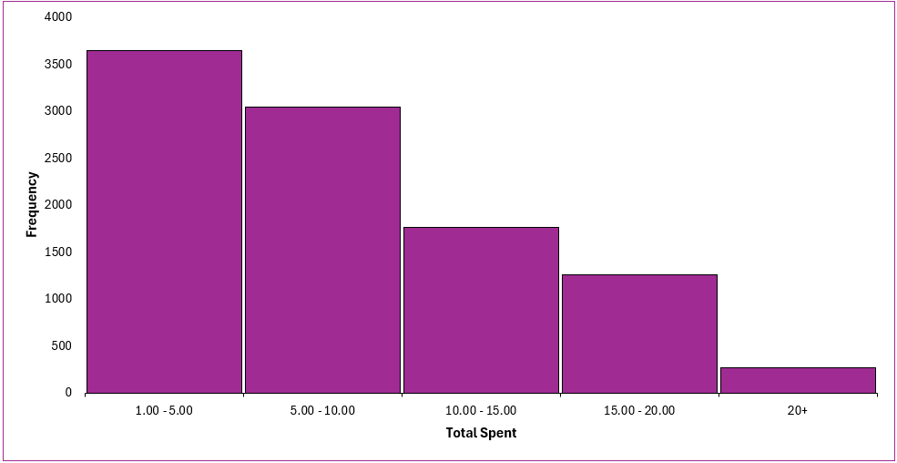

**Skewed Distribution:**
- The distribution is skewed to the right, meaning that most customers spend relatively small amounts in a single transaction. Almost 70% of the total spent in a single transaction ranges between $1.00 and $10.00. 

**Recommendations:** 
- Offering discounts when spending over $10.00 may incentivize more mid to high-spenders.

#### 5. What Item generates the most Revenue?

```sql
SELECT 
	DISTINCT Item,
    `Price Per Unit`,
    SUM(`Total Spent`) AS Total_revenue,
    ROUND((SUM(`Total Spent`) * 100.0 / (SELECT SUM(`Total Spent`) FROM cafe_sales)), 2) AS Revenue_Percentage
FROM cafe_sales
GROUP BY 1,2
ORDER BY 3 DESC; -- Salad generates the most revenue with 19,240
```
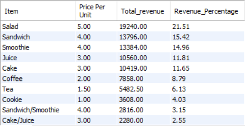

**Best-Selling Items:**
- Salads lead sales with a total revenue of $19,240, contributing 21.51% of total revenue.

- Sandwiches and Smoothies follow closely, with revenue shares of 15.42% and 14.96%, respectively.

- The top three items (Salad, Sandwich, Smoothie) account for over 51% of total revenue.

**Worst-Selling Items:**
- Cookie generates the least amount of revenue of $3,608, contributing 4.03% of total revenue.

- Tea and Coffee follow closely, with 4.03% and 6.13%, respectively.

- The bottom three items (Cookie, Tea, Coffee) contribute less than 19% combined.

**Trend:**

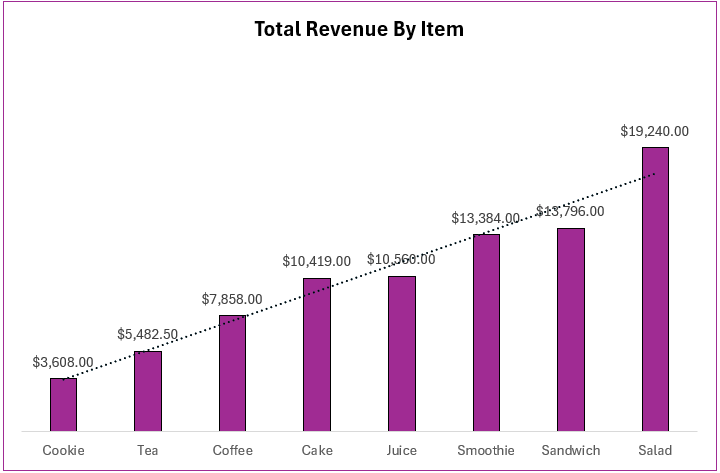

- The total revenue of an Item is corollary to its price. The higher the price per unit, the higher the total revenue generated. 

#### 6. Revenue By Payment Method?

```sql
SELECT 
	`Payment Method`,
    SUM(`Total Spent`) AS Total_revenue,
    ROUND((SUM(`Total Spent`) * 100.0 / (SELECT SUM(`Total Spent`) FROM cafe_sales)), 2) AS Revenue_Percentage
FROM cafe_sales
GROUP BY `Payment Method`
ORDER BY Total_revenue DESC; -- Credit Card is the known payment method that generates the most revenue
```

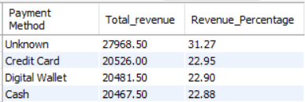

**"Unknown" Payment Method:**
- Approximately 1/4 of the Payment Methods used in transactions are classified as "unknown". These unclassified transactions need urgent investigation to ensure accurate tracking and potential optimization, which will also provide more actionable insights.

**Diverse Customer Preference:**
- All known Payment Methods have similar transactional figures. Offering convenient and flexible Payment Methods makes it easier for customers to return and buy again as it caters to all shopping habits, increasing customer satisfaction and overall revenue potential.

**Payment Method Optimization:**
- It may be worth encouraging Digital and credit card payments. These methods provide a better transaction experience for customers and businesses as they are faster and reduce errors in handling cash compared to traditional cash payment methods.
  
- Credit Card & Digital Payment methods enable online and contactless payments, enhancing convenience. This also allows the opportunity to set up additional services such as Click & Collect (possibly through an app), negating the need for customers to queue up.

#### 7. Revenue By Location?

```sql
SELECT 
	Location,
    SUM(`Total Spent`) AS Total_revenue,
    ROUND((SUM(`Total Spent`) * 100.0 / (SELECT SUM(`Total Spent`) FROM cafe_sales)), 2) AS Revenue_Percentage
FROM cafe_sales
GROUP BY Location
ORDER BY Total_revenue DESC; -- In-store is the known location that generates the most revenue
```
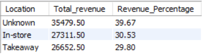

**Data Accuracy Concern:**
- Almost 40% of revenue is labeled as "Unknown" transaction locations. Tracking systems must be refined to avoid data inaccuracy for clearer business insights.

**Known Location:**
- There is no distinct customer preference for dining in-store or takeaway, both channels are even in terms of revenue.

#### 8. Sales Revenue Performance By Month?

```sql
SELECT 
	MONTHNAME(`Transaction Date`) AS `month`,
    SUM(`Total Spent`) AS Total_revenue
FROM cafe_sales
GROUP BY `month`
ORDER BY Total_revenue DESC; -- January generates the most revenue with 7,808.50 but pretty even across the board
```
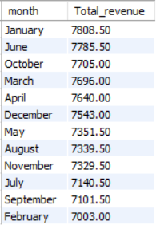

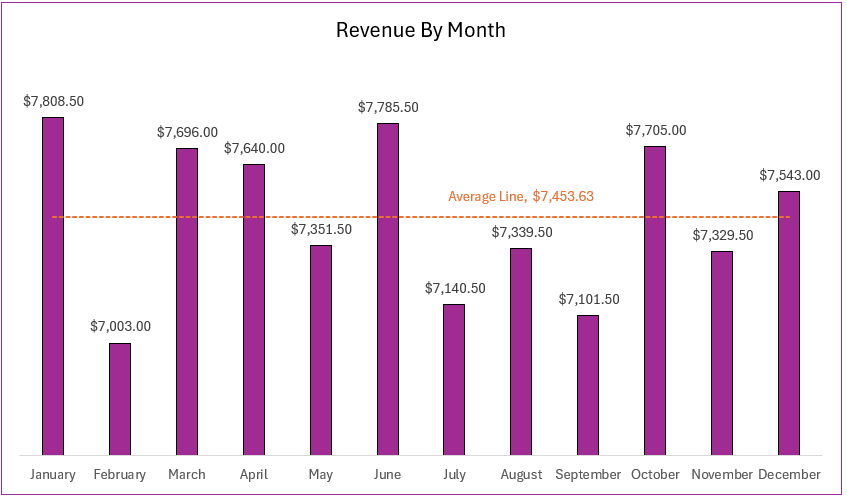

**Insights:**
- The highest Revenue by month is January ($7,808.50), and the lowest is February ($7,003.00), displaying a difference of $805.50.

- The average revenue per month is $7,463.63 which serves as a benchmark to compare individual months. No month deviates more than $500 from the mean ($7,463.63). In addition, half the months are above the average, and the other half are below, indicating balanced revenue streams.

- Overall, revenue fluctuates every month but remains very stable, maintaining itself within the $7,000 range.

#### 9. Seasonal Trend?

```sql
SELECT
	DISTINCT CASE
		WHEN MONTHNAME(`Transaction Date`) = 'January' THEN 'Winter'
		WHEN MONTHNAME(`Transaction Date`) = 'February' THEN 'Winter'
		WHEN MONTHNAME(`Transaction Date`) = 'March' THEN 'Spring'
		WHEN MONTHNAME(`Transaction Date`) = 'April' THEN 'Spring'
		WHEN MONTHNAME(`Transaction Date`) = 'May' THEN 'Spring'
		WHEN MONTHNAME(`Transaction Date`) = 'June' THEN 'Summer'
		WHEN MONTHNAME(`Transaction Date`) = 'July' THEN 'Summer'
		WHEN MONTHNAME(`Transaction Date`) = 'August' THEN 'Summer'
		WHEN MONTHNAME(`Transaction Date`) = 'September' THEN 'Autumn'
		WHEN MONTHNAME(`Transaction Date`) = 'October' THEN 'Autumn'
		WHEN MONTHNAME(`Transaction Date`) = 'November' THEN 'Autumn'
		WHEN MONTHNAME(`Transaction Date`) = 'December' THEN 'Winter'
	END AS season,
    SUM(`Total Spent`) AS Total_Revenue,
    ROUND((SUM(`Total Spent`) * 100.0 / (SELECT SUM(`Total Spent`) FROM cafe_sales)), 2) AS Revenue_Percentage
FROM cafe_sales
GROUP BY 1
ORDER BY 2 DESC;
```
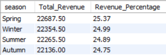

**Marketing & Promotions:** 
- There is no seasonal trend. Seasonal promotions during occasions like Christmas, New Year, Easter, and Halloween can boost sales by providing festive-themed products or seasonal discounts, such as Winter Sales.

#### 10. Sales Revenue Performance By Day?

```sql
SELECT 
	DAYNAME(`Transaction Date`) AS `Day of week`,
    SUM(`Total Spent`) AS Total_revenue
FROM cafe_sales
GROUP BY `Day of week`
ORDER BY Total_revenue DESC; -- Thursday generates the most revenue with 13062.50
```
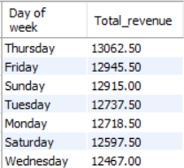

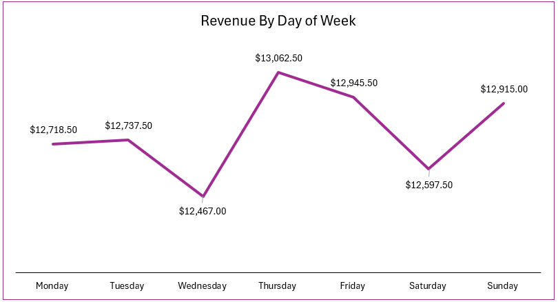

**Insights:**
- Thursday generated the highest revenue, reaching $13,062.50, slightly outperforming the other days. This indicates peak customer activity.

- Wednesday generated the lowest revenue, reaching $12,467.00, suggesting it might be a slow day compared to others.

- The difference between the highest (Thursday) and lowest (Wednesday) revenue is $595.50, indicating a relatively steady revenue stream throughout the week.

## 5. Cafe Sales Dashboard
Link to dashboard: *[Cafe Sale Dashboard](cafe_dashboard)*

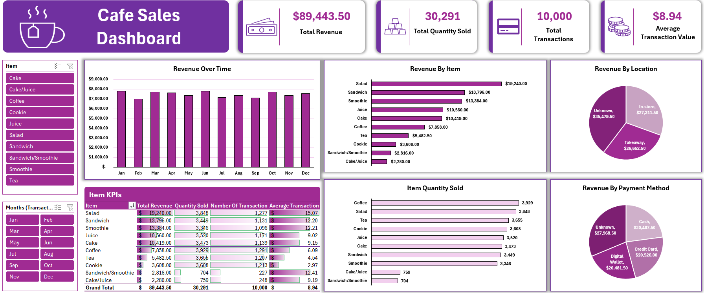

## 6. Conclusion & Recommendations

**Sales Performance Overview:**

- **Monthly Sales:** The average monthly revenue generated is $7,463.63, where no month deviates more than $500 from the mean as revenue peaks in January ($7,808.50) and dips the lowest in February ($7,003.00).

- **Product Performance:** There is a small difference of 583 in the quantity sold between the most sold item (3,929) and the least sold (3,346). This displays stable revenue streams with no dependencies on any single item to perform extremely well.

- However, the revenue generated by each item is corollary to its price per unit rather than the number of units sold. For instance, Coffee, despite being the most popular item sold, only accounts for 8.79% of revenue. Whereas Smoothie, the least popular item sold, generates 14.96% of the revenue because it is listed at a higher price.

**Customer Behavior Overview:**

- **Customer Spending Habits:** The average amount spent on a single transaction ($8.94) is closer to the lowest ($1.00) than the highest ($25.00). However, it is also worth mentioning that the average is still higher than the most expensive item ($5.00). This implies that people are more likely to purchase multiple items, which may be influenced by the low prices.

- **Diverse Customer Preference:** All known Payment Methods have similar transactional figures. Offering convenient and flexible Payment Methods makes it easier for customers to return and buy again as it caters to all shopping habits, increasing customer satisfaction and overall revenue potential.

- There is no distinct customer preference for dining in-store or takeaway, both channels are even in terms of revenue.

**Recommendations:**

- **Marketing & Promotions:** 
  - Seasonal promotions during occasions like Christmas, New Year, Easter, and Halloween can boost sales by providing festive-themed products or seasonal discounts, such as Winter Sales.
 
  - Introduce Mid-week & weekend Promotions to boost sales throughout the whole week.

  - Increase the Average Transactional Value of $8.94 by offering a discount when customers spend over $10.00.

- **Upselling:** 
  - Customers tend to order the same items such as their morning coffee. Therefore, it is best practice to encourage customers to order a larger-sized coffee by emphasising the minimal cost difference. 

  - Offer alternative types of milk for an additional cost for customers' coffee. With salad being the second most popular item sold, it is reasonable to assume there is a high demand for healthier options and/or growth in veganism and similar dietary lifestyles where plant-based milk will appeal to these customer segments. 

  - Expand the menu with hot chocolate, lattes and frappes. These drinks are highly customizable which provides the opportunity to offer a premium or upgraded version for an additional cost to add toppings such as marshmallows, grated chocolate, flakes, syrup etc. 

- **Crossing-selling:** 
  - Promote different products from different categories in a transaction. For example encourage customers to buy cookies or cake with their tea or coffee.

  - Offer bundles such as a ‘meal deal’, where customers can purchase a beverage, a sandwich, and a snack together.